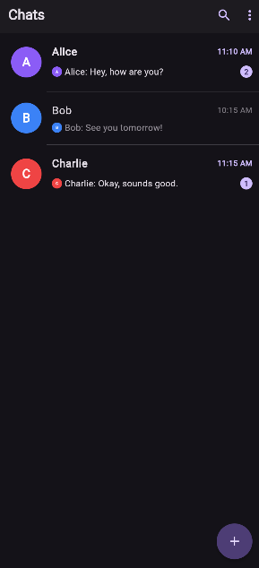
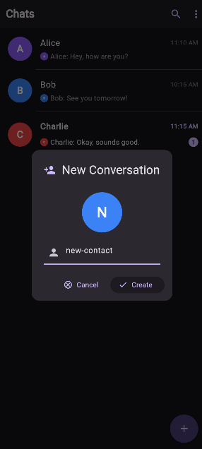
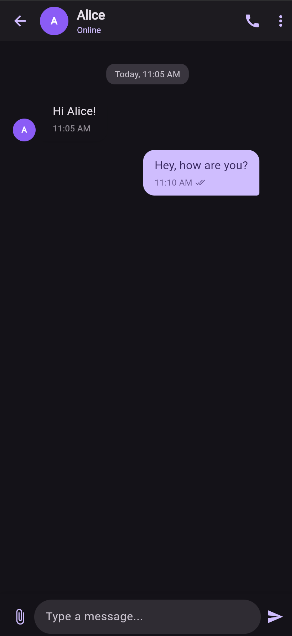
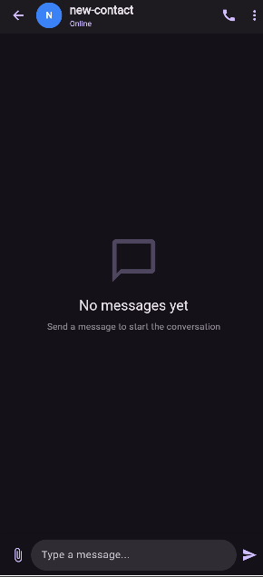
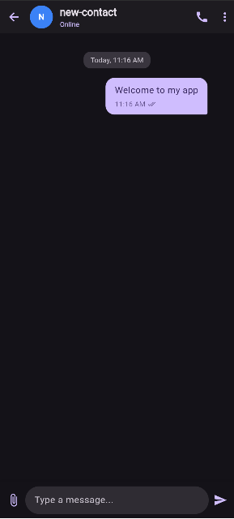
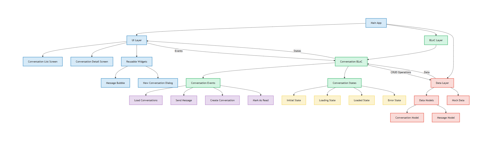

# Flutter Chat App

A modern messaging application built with Flutter and Bloc pattern for state management. This application provides a clean, intuitive interface for chatting with contacts in real time.



## Features

- **Modern Material 3 Design**: Clean, intuitive interface with support for both light and dark modes
- **Conversation Management**: Create, view, and manage multiple conversations
- **Real-time Messaging**: Send and receive messages with automatic replies for demo purposes
- **Message Status**: Track read/unread status with visual indicators
- **Avatar Generation**: Automatic avatar generation based on contact names
- **Responsive Layout**: Works on various screen sizes
- **Bloc Pattern Architecture**: Clean separation of concerns using the BLoC pattern

## Screenshots

| Chats List | New Conversation Dialog | Chat Detail |
|------------|-------------------------|-------------|
|  |  |  |

| Empty Chat | First Message |
|------------|---------------|
|  |  |

## Architecture

This application follows the BLoC (Business Logic Component) architecture pattern, providing a clean separation of concerns:



### Key Components:

- **Models**: Data structures for conversations and messages
- **BLoC**: Business logic for managing conversations and messages
- **Screens**: UI components for displaying conversations and messages
- **Utils**: Helper functions and utilities

## Project Structure

```
lib/
├── bloc/                  # BLoC pattern implementation
│   └── conversation/      # Conversation and message management logic
├── data/                  # Data sources (mock data for demo)
├── models/                # Data models
│   ├── conversation_model.dart
│   └── message_model.dart
├── screens/               # UI screens
│   ├── conversation_detail_screen.dart
│   └── conversation_list_screen.dart
├── utils/                 # Utility functions
│   └── avatar_utils.dart
└── main.dart              # Application entry point
```

## Getting Started

### Prerequisites

- Flutter SDK (3.7.2 or higher)
- Dart SDK (3.0.0 or higher)

### Installation

1. Clone this repository
   ```bash
   git clone https://github.com/youssef-faik/chat_app
   ```

2. Navigate to the project directory
   ```bash
   cd chat_app
   ```

3. Get dependencies
   ```bash
   flutter pub get
   ```

4. Run the app
   ```bash
   flutter run
   ```

## Dependencies

- **flutter_bloc**: State management using the BLoC pattern
- **equatable**: Value equality for models
- **intl**: Internationalization and formatting

## Future Enhancements

- User authentication and registration
- Real-time messaging with Firebase
- Media sharing (images, videos, files)
- Message search functionality
- Push notifications
- End-to-end encryption
- Message reactions and replies
- Voice and video calling

## License

This project is licensed under the MIT License - see the LICENSE file for details.

## Acknowledgements

- Flutter Team for the amazing framework
- BLoC pattern contributors for the state management solution
- The open source community for their invaluable resources
